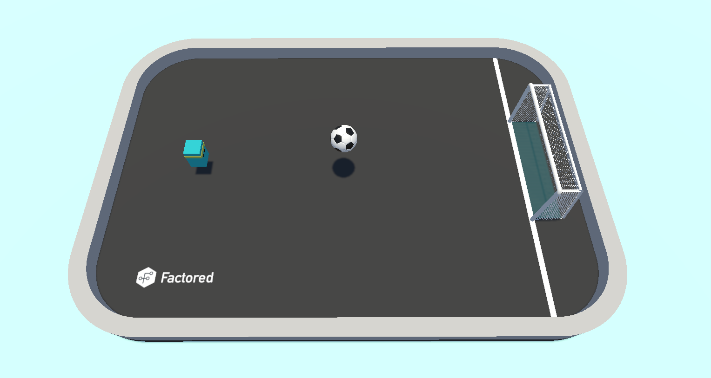
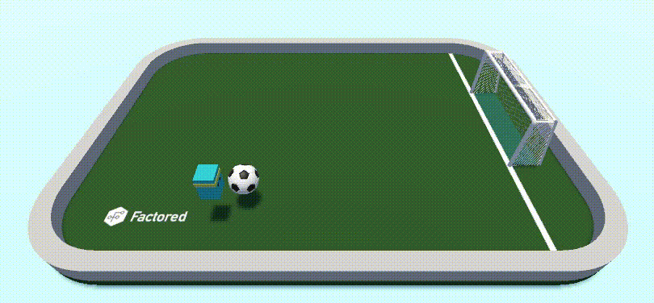

# Mini Football Environment ⚽
Simple reinforcement learning environment made in Unity:

## Observation Space
The state consist of the following data points (all 3 dimensional):
- Player's local position
- Ball's local position
- Ball's velocity
- Ball's angular velocity
- Goal's position

This means each time step the state is a (batch_size, 15) array. However, the state is stacked with the previous state into a single vector, doubling its size to (batch_size, 30).

## Action Space
The actions space consists of 2 continuous actions and 1 discrete action.
- [-1,1] for horizontal movement. -1 is move left and 1 move right.
- [-1,1] for vertical movement. -1 is move backwards and 1 move forward.
- 0: No jump, 1: jump

## Rewards
The agent objective is to get the ball into the goal. 
 - +1.0000 when the ball enters the goal. Golazo!
 - +0.0500 when the ball crosses the white line. 
 - +0.0100 when the player hit the ball.
 - -0.0001 existential penalty.
 
 ## Episode Termination
 The episode finishes when the ball gets inside the net, passes the white line or 1000 steps are reached.
 
 ## Starting State
 Both the player and the ball are placed randomly on the field. The goal position is fixed.
 
 ## Completion
 The environment is considered solved when the reward average over 100 episodes is greater than 0.9.

 ## Agent in Action
 Check an agent that solved mini football:

